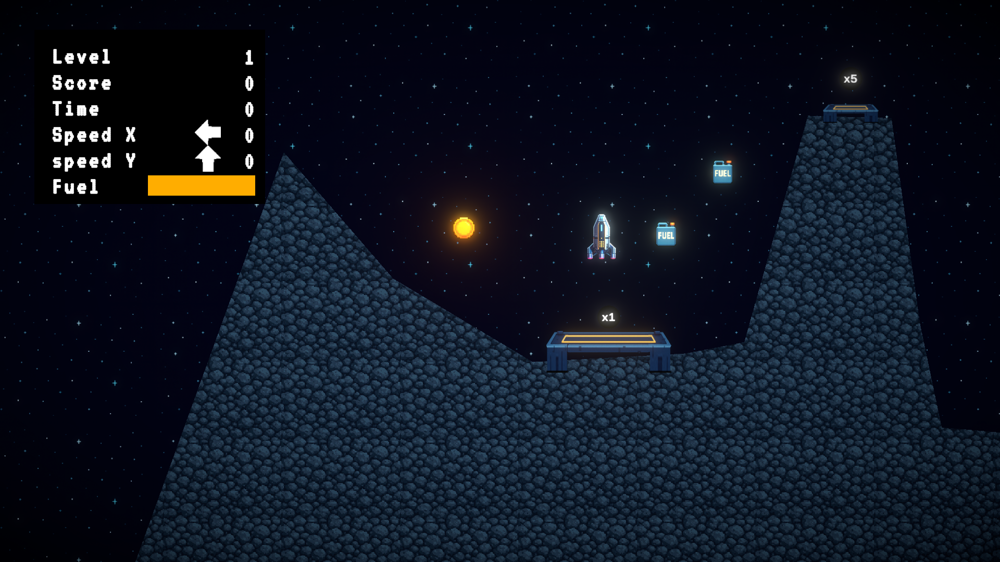

# LuaLander

LuaLander is a 2D lunar-landing game built with Unity. Pilot a fuel-limited lander through rocky terrain, collect bonuses, and touch down gently on the highest-value landing pad.

> **Status:** Work in progress. The core gameplay loop and multi-level campaign are playable; balancing, polish, and a downloadable build are still in development.

## Highlights

- Physics-based flight, fuel consumption, and landing evaluation
- Score based on landing speed, angle, and pad multiplier
- Coins, fuel pickups, pause flow, retry flow, and final score screen
- Keyboard, gamepad, and on-screen mobile controls
- Multi-level campaign assembled from reusable Unity prefabs
- Dynamic 2D camera powered by Cinemachine

## Controls

| Action | Keyboard | Gamepad |
| --- | --- | --- |
| Thrust | `W` or `Space` | South button or right trigger |
| Rotate left | `A` or `Left Arrow` | D-pad/left stick left |
| Rotate right | `D` or `Right Arrow` | D-pad/left stick right |
| Pause | `Esc` | — |

## Built With

- Unity `6000.5.7f1`
- C#
- Universal Render Pipeline (2D)
- Unity Input System
- Cinemachine

## Run Locally

1. Clone this repository.
2. Open the project with Unity `6000.5.7f1` or a compatible Unity 6 version.
3. Open `Assets/Scenes/MainMenuScene.unity`.
4. Press Play.

## Project Structure

- `Assets/Scripts` — gameplay and UI logic
- `Assets/Scenes` — menu, gameplay, and game-over scenes
- `Assets/Prefabs` — levels, pickups, landing pads, and effects
- `Assets/Editor/LevelCampaignBuilder.cs` — editor tool for assembling the campaign

## Credits

This learning project includes Code Monkey Free assets, Unity/TextMesh Pro package assets, and the VT323 font under the SIL Open Font License.
